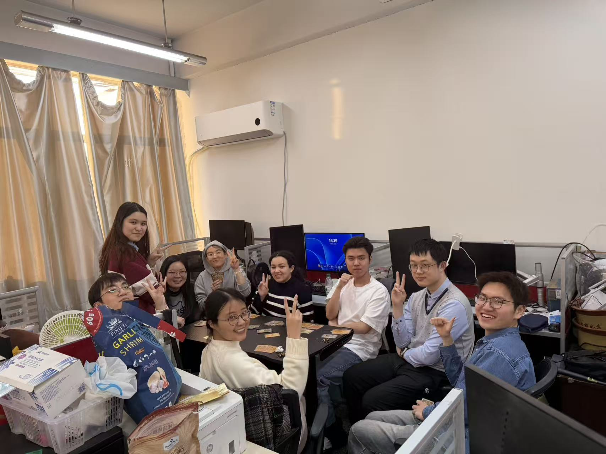
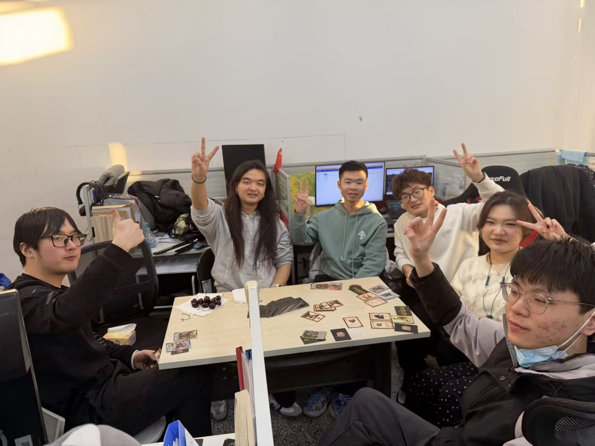
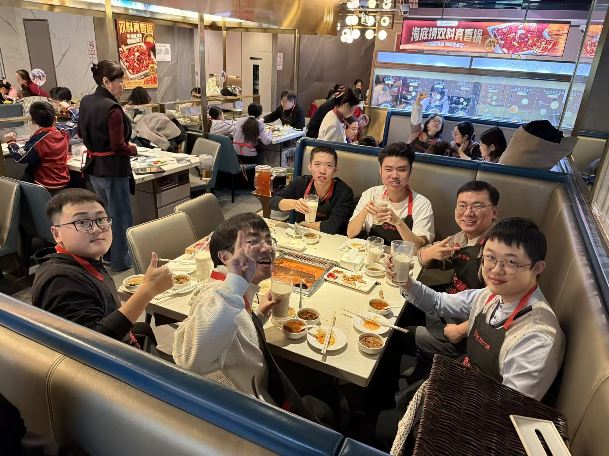
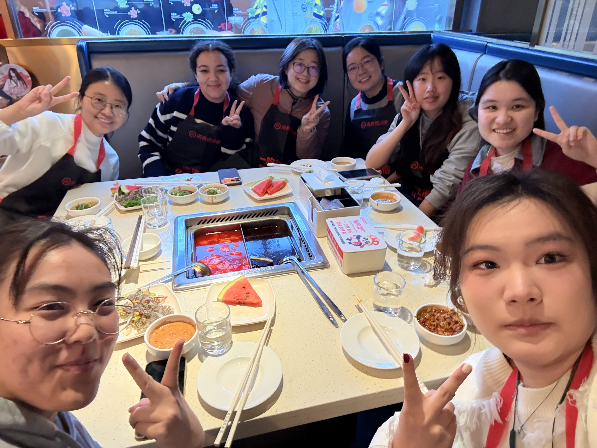

<!-- 娱乐 -->

    <h2 style="font-family: 'Source Sans Pro', sans-serif; font-size: 28px; color: #444; border-left: 5px solid #8cc9f0; padding-left: 15px; margin-bottom: 20px;">娱乐</h2>
    

        实验室偶尔会有些小小的棋牌娱乐活动，包括但不限于三国杀、狼人杀、掼蛋、阿瓦隆、女巫镇。
    

    

        

            
        

        

            
        

    

<!-- 聚餐 -->

    <h2 style="font-family: 'Source Sans Pro', sans-serif; font-size: 28px; color: #444; border-left: 5px solid #ffb347; padding-left: 15px; margin-bottom: 20px;">聚餐</h2>
    

        实验室在学长学姐毕业时还有年终元旦时，都会有老师请客的聚餐活动，大家可以爽吃！
    

    

        

            
        

        

            
        

        

            
        

    

